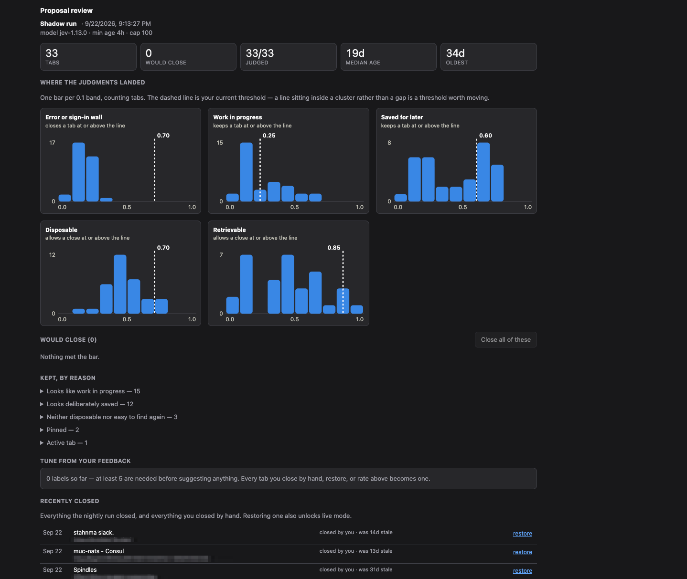

# Tabby

Keeps a browser full of tabs tidy, without you having to think about it.

If you routinely run several dozen open tabs, most of them are dead weight — a search results
page you already used, a 404, a site that logged you out three weeks ago. A handful are not:
an open pull request, a half-finished checkout, the article you actually mean to read. Closing
the first group by hand means picking through the second, which is why nobody does it.

Tabby looks at every open tab each night, decides which ones you would not miss, and closes
them — after archiving each one so nothing is ever truly gone.

It ships in **shadow mode**: for as long as you like, it only shows you what it *would* close.
Nothing disappears until you say so.



The review page is where you decide whether to trust it. Every tab it *kept* is grouped by
the reason it was spared, and each histogram shows where your threshold falls against the
actual spread — a line sitting inside a cluster rather than a gap is a line worth moving.

## What decides

Judgments come from [TypeSafe AI's **Jev**](https://docs.typesafe.ai), which is not a chatbot.
Given a tab's title and address it answers five narrow questions with probabilities — *is this
unfinished work? already consumed? easy to find again? deliberately saved? an error or a login
wall?* — and your settings turn those into a verdict.

It costs about half a cent for a full sweep of 70-odd tabs, and most nights nothing at all,
because a tab is only ever judged once.

## Setting it up

**1. Install it.** Go to `chrome://extensions`, turn on **Developer mode**, click **Load
unpacked**, and pick this folder. Chrome 121 or newer.

**2. Try it with no account.** Click the Tabby icon → **Run now**. The first run uses fake
judgments, costs nothing, and touches no network — it exists so you can see the shape of the
thing against your real tabs. The header reads `shadow · mock` so you know it isn't real yet.

**3. Point it at the real model.** Get an API key from [typesafe.ai](https://typesafe.ai),
then **Settings** → paste the key → **Save** → set Transport to `direct` → **Save** again.
Now **Run now** for real. The first real sweep judges every tab; later ones are nearly free.

**4. Read what it proposes.** The popup lists what it would close; **review all** opens the
full page, which is where the interesting part is — every tab it *kept*, grouped by the reason
it was spared. That tells you which setting is doing the work.

**5. Let it watch for a couple of weeks** before giving it teeth. Shadow mode costs you
nothing and it is the only way to find out whether the thresholds match your judgment.

**6. Turn it loose.** Restore one archived tab from the popup first — that proves the safety
net works, and it is what unlocks the toggle. Then **Settings** → uncheck **Shadow mode**.
From then on it runs at 3:30am and closes quietly.

## Using it

**Teach it, one click at a time.** On the review page each row offers the corrections that
make sense for it: *keep it* when it was wrong, *dead* when it missed an error page, and
*never / always this site* for whole domains. The site rules take effect immediately.

You also teach it just by using it — closing a tab by hand records "you missed this", and
restoring one records "you shouldn't have closed this".

**Then let it retune itself.** The **Tune from your feedback** panel replays every correction
you have made against thousands of candidate settings and tells you plainly what it found:
*"agrees with 78% of your decisions; raising work-in-progress from 0.25 to 0.45 resolves 6
disagreements."* Applying it is one click, and it never costs a request.

It deliberately weights closing something you wanted **three times** worse than leaving a
stale tab open.

**What it will never close**, regardless of any setting: a pinned tab, a tab playing audio,
the tab you're looking at, the only tab in a window, anything on your never-close list, and
anything opened in the last few hours.

## Settings worth knowing

| | |
|---|---|
| **Shadow mode** | On: proposes only. Off: closes for real. Default on. |
| **Minimum age** | How long a tab must sit untouched before it's a candidate. Default 2 hours. |
| **Age alone closes after** | Past this, staleness is enough on its own. Default 14 days; 0 turns it off. |
| **Max closes per run** | A cap on the damage from any one night. Default 25. |
| **Thresholds** | The five gates. Drag them and the preview updates instantly. |
| **Never close** | Hosts to leave alone entirely. |

## What leaves your browser


Only a tab's **title and address** are ever sent, and the address is stripped first: query
strings, fragments, and anything that looks like a token or an id are removed, so a one-time
login link goes as `fly.io/app/auth/cli/…`.

Everything else stays on your machine — when you last looked at a tab, whether it's pinned,
your thresholds, your feedback, and the decision itself. Tabby never reads page *content*;
it holds no permission that would let it.

[docs/data-flow.md](docs/data-flow.md) shows a real request, if you want to see exactly what
that looks like.

## If something looks wrong

Open `chrome://extensions` → Tabby → **service worker**, and run:

```js
await tabby.diagnose()
```

That reports which settings are actually in force, which judgments are cached, and why each
tab was kept — enough to tell tuning from a bug.

---

Building on it? See [docs/development.md](docs/development.md).
