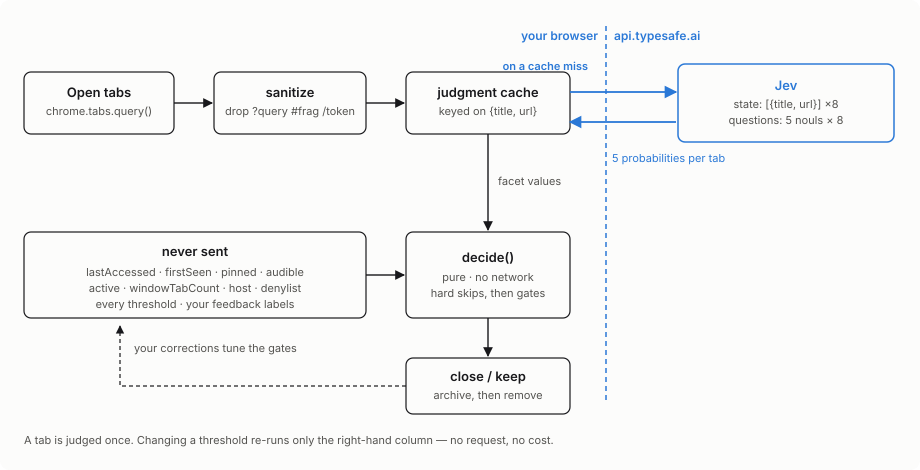

# Data flow

What this program reasons about locally, and what actually reaches Jev.



## The shape of the thing

Jev is not an LLM and this is not a prompt. You hand it **one state** and **many typed
questions** over that state, and it returns a probability per question. No prose, no JSON to
repair, no parsing. The whole request is three fields: `model`, `state`, `questions`.

The design consequence that matters: because the answers are just numbers, they can be
**stored and reused**. Everything time-dependent is therefore kept out of the state, so the
same tab hashes the same way tomorrow and the judgment still applies.

## What crosses the network

Exactly this, per tab:

```json
{
  "tabs": [
    {
      "title": "Page not found – Claude",
      "url": "https://claude.ai/code/artifact/…"
    },
    {
      "title": "CLI Sign in · Fly",
      "url": "https://fly.io/app/auth/cli/…"
    }
  ]
}
```

That is the entire description of a tab that Jev ever sees. Note what survived sanitizing:
the Claude artifact UUID and the Fly CLI auth token were both in the **path**, and both are
gone. Query strings and fragments never make it this far either.

Note also what is *absent*: no `lastAccessed`, no `pinned`, no `audible`. Those are crisp
local facts a classifier adds nothing to — and, fatally, they change on every run, so
including them would change the cache key every run and re-bill inference nightly.

## What the questions look like

10 questions accompany that state — five per tab, `t0_wip`, `t0_disp`, `t0_retr`, `t0_save`, `t0_dead`, … — each one
fully self-contained, because **question ids are not sent to the model**. `t0_dead` means
nothing to Jev; all the meaning has to be in the text, including which tab it refers to.

```json
{
  "t0_dead": {
    "type": "noul",
    "instructions": "Consider only the single browser tab described at `tabs[0]`, using `tabs[0].title` and `tabs[0].url`. Query strings and fragments have been removed from the URL, so the title often carries most of the meaning. Is this tab showing an error or a barrier instead of the content it was opened for -- a \"page not found\" or 404, \"this page is unavailable\", a server or application error, an expired or broken link, or a login, sign-in or \"your session has expired\" screen standing where the content used to be? Judge what the page is showing now, not what its address suggests it once held: an address that looks like a document, a ticket or an account page still counts here if the page itself is an error or a sign-in wall.",
    "criteria": {
      "true": "The visible page is an error, a not-found page, or a sign-in / session-expired screen -- there is no content on it to come back to.",
      "false": "The page is showing real content, whatever that content happens to be."
    }
  }
}
```

Three things worth copying if you build something like this:

- **The backticked path** (`` `tabs[0].title` ``) is how a question points at part of the
  state. It is why one request can carry forty independent judgments.
- **`criteria`** is a rubric, not decoration. For a noul it takes a `true` and a `false`
  description, and it is where you rule things out. The whole "a 404 is not work in progress"
  fix lives in the `false` side of `wip`, not in the instructions.
- **One narrow judgment per question.** `dead` and `disposable` sound similar but ask
  different things — *showing an error* versus *already consumed* — and keeping them separate
  is what lets a dead page override a keep.

## What comes back

```json
{ "model": "jev-1.13.0",
  "answers": { "t0_dead": { "type": "noul", "noul": 0.96 }, "t0_wip": { "type": "noul", "noul": 0.29 } },
  "usage": { "input_tokens": 341, "output_tokens": 22 } }
```

A noul carries **no confidence field** — the single probability describes a two-outcome
distribution completely. (Choice and score do carry one; it measures how concentrated the
distribution is, *not* permission to act.)

## Where the decision is actually made

Not at Jev. It returns five probabilities per tab and stops. Everything that turns those into
a verdict is local and pure:

```
close  iff  age >= minAgeHours
       AND  (dead >= 0.70  →  close outright, overriding the two keeps below)
       AND  wip           <  0.25
       AND  savedForLater <  0.60
       AND  (disposable >= 0.70  OR  retrievable >= 0.85  OR  age >= 14 days)
```

Independent gates, never a weighted sum. Probabilities from *separate* questions cannot be
combined arithmetically — a noul and its negation do not sum to 1 — so adding them up would
be a quiet correctness bug. Gates are also debuggable: every kept tab names the gate that
stopped it.

## Why this shape pays off

A tab is judged **once**. Retuning any threshold re-runs only the local half — instantly,
against stored judgments, at zero cost. That is what makes the feedback loop viable: your
corrections sweep hundreds of candidate settings without issuing a single request.

Cold, a 74-tab night is ten requests and well under a cent. Warm, it is usually zero.
